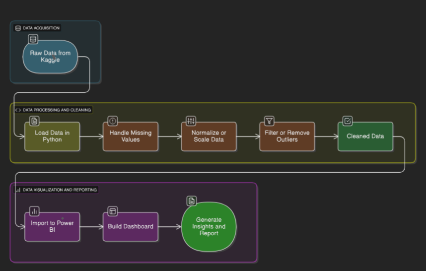

# Crime Trend Analysis in India

## 📌 Project Overview
This project provides a comprehensive **analysis of crime trends in India** using **Power BI, Python (EDA), and Microsoft Excel**.  
The goal is to uncover crime patterns, hotspots, and law enforcement efficiency through **interactive dashboards and exploratory analysis**.

## 🛠️ Tools & Technologies
- **Power BI** → Data visualization and interactive dashboarding
- **Python (Pandas & Matplotlib)** → Exploratory Data Analysis (EDA)
- **Visual Code** → Notebook execution and data cleaning
- **Microsoft Excel** → Data Modeling and processing

## 📂 Repository Structure
Crime-Trend-Analysis-India/
│── data/
│ └── crime_dataset_india.csv # Dataset
│── reports/
│ └── Crime Trend Analysis in India.pbix # Power BI file
│ └── Crime Trend Analysis in India.pdf # Final Report
│── diagrams/
│ └── workflow.png
│── README.md

## 🔄 Workflow
The project follows this workflow:

**Steps:**
1. 📥 **Data Collection** → Kaggle dataset (CSV)  
2. 🐍 **Python (EDA)** → Data cleaning, trends, and analysis  
3. 📊 **Excel** → Data modeling & preprocessing  
4. 🗂️ **Cleaned Data** → Prepared for visualization  
5. 📈 **Power BI (DAX Operations)** → Interactive dashboard creation  
6. 📉 **Dashboard** → Visual insights  
7. 📝 **Report** → Final insights & documentation  

---

## 📊 Dashboard Features
- **Crime Trends over Time** (YOY & Monthly analysis)  
- **Geospatial Distribution** of crimes across Indian cities  
- **Victim Demographics** (age & gender distribution)  
- **Crime Types & Weapon Usage**  
- **Law Enforcement Response** (case closures & police deployment)  

---

## 📑 Dataset Information
- **Source:** Kaggle crime dataset  
- **Key Fields:**
  - State/UT
  - Year
  - Type of Crime
  - Victim demographics
  - Weapon used
  - Reported cases & Case closure status  

---

⭐ If you like this project, don’t forget to **star the repo** and connect with me!  

